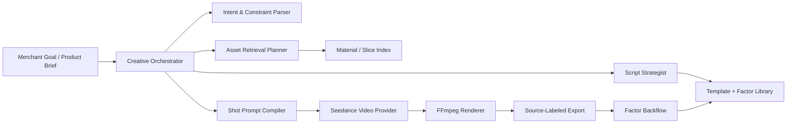

# Agent Architecture

This project is a video-generation workflow, not a shopping-guide chatbot. Still, the Viking AI
Search ecommerce-guide practice gives useful architecture principles for building an expert creative
agent: curate decision-grade data, combine retrieval with generation, expose tool steps, and keep
business orchestration behind the backend.

## Transferable Ideas From Viking AI Search

- Prepare data from the user's decision perspective. Do not dump every database field into the
  agent context. Keep fields that influence creative decisions: product title, category, selling
  points, audience, usage scene, source statement, compliance state, visual tags, slice summary and
  performance factors.
- Treat multimodal assets as first-class searchable items. Product images, product videos and
  reference materials need public-access checks, quality checks, source declarations, structured
  tags, summaries and embeddings before they are useful to downstream generation.
- Retrieval strategy and answer/generation strategy must be tuned together. A better script prompt
  cannot compensate for weak asset recall, and good slices can still produce poor videos if the
  prompt compiler loses product truth or compliance constraints.
- Expose the agent's work steps. The frontend and job trace should show intent recognition,
  retrieval, tool calls, provider attempts, fallback decisions and final render provenance.
- Keep API keys and tool calls behind the business backend. The frontend should call our API; the
  API/worker owns Ark, storage, retrieval, compliance and analytics credentials.
- Iterate with representative samples before scaling. Use 50-100 curated product/material cases to
  evaluate indexing, script quality, visual faithfulness, fallback frequency and conversion-factor
  attribution.

## Creative Agent Roles

- `Creative Orchestrator`: coordinates product brief, merchant prompt, target channel, compliance
  state, provider availability and retry policy.
- `Intent & Constraint Parser`: extracts creative goal, target audience, channel, aspect ratio,
  language, forbidden claims and required proof points.
- `Asset Retrieval Planner`: rewrites each shot into material queries and combines keyword, tag and
  embedding recall over product/video/slice levels.
- `Script Strategist`: chooses or generates a strategy from templates such as pain-point rescue,
  scene seeding, proof comparison and trust offer.
- `Shot Prompt Compiler`: converts product truth, methodology factors, shot role, asset hints and
  compliance constraints into Seedance-ready prompts.
- `Provider Router`: uses `ARK_TEXT_MODEL` for reasoning/script generation and `ARK_VIDEO_MODEL` for
  Seedance video generation; falls back to mock/material rendering only with explicit provenance.
- `Render & Provenance Layer`: preserves Ark/Seedance source audio when available, adds subtitles,
  produces 9:16 or 16:9 exports, and labels outputs as `ARK_GENERATED`, `HYBRID_MIX`,
  `MATERIAL_MIX`, `DYNAMIC_FALLBACK` or `STORYBOARD_FALLBACK`.
- `Evaluation Loop`: feeds CTR, CVR, GMV, watch time and human review notes back into factor-level
  analytics and template selection.

## Agent State Model

The agent should store compact, inspectable state instead of relying on one giant prompt.

| State             | Purpose                             | Example                                                           |
| ----------------- | ----------------------------------- | ----------------------------------------------------------------- |
| Product truth     | Prevent hallucinated product claims | title, category, selling points, audience, scenario               |
| Material memory   | Retrieve visible proof              | asset tags, slice summary, thumbnail, embedding, source statement |
| Strategy memory   | Reuse proven creative patterns      | template id, hook factor, proof factor, CTA factor                |
| Compliance memory | Block unsafe outputs                | forbidden words, missing source, reference-only policy            |
| Provider memory   | Explain model behavior              | text model configured, video model configured, fallback reason    |
| Outcome memory    | Improve next generation             | factor metrics, variant winner, human notes                       |

## Tool Contract

The orchestrator should interact with tools through explicit typed calls:

- `retrieveAssets(shotIntent, productId)`: returns ranked slices with scores and source metadata.
- `generateScripts(product, strategyHints)`: returns structured scripts validated by Zod.
- `compileShotPrompt(product, script, shot, methodology, assetHints)`: returns prompt plus
  compiler trace.
- `generateShotVideo(shotPrompt, referenceImage?)`: returns task id, provider status, artifact URL,
  native-audio request flag and sanitized debug shape.
- `reviewCompliance(objectType, objectId)`: returns status, triggered rules and fix suggestions.
- `renderExport(shots, materials, audioPolicy)`: returns MP4 URL, cover URL, clip stats and render
  source.
- `ingestMetrics(rows)`: imports manual/CSV/external performance signals with source labels.

## Trace Design

Each long job should emit trace events that mirror an expert agent's reasoning path without leaking
secrets:

1. `intent`: parsed merchant goal, aspect ratio, language and channel.
2. `retrieval`: rewritten shot queries, selected slices and recall scores.
3. `strategy`: selected template, factors and constraints.
4. `compile`: prompt compiler version and prompt provenance fields.
5. `provider`: Ark text/video configuration status, task ids and sanitized fallback reasons.
6. `render`: clip source counts, audio policy, duration and resolution.
7. `export`: final URL, render source and compliance status.

## Practical Roadmap

- P0: Keep the current workflow stable, but make the trace prove that every export came from a
  product brief, methodology, retrieval hints and a source-labeled render path.
- P1: Add an `AgentRun` record that stores planner state, tool calls, retrieved slice ids, prompt
  compiler traces and provider outcomes.
- P1: Add query-rewrite tests for shot-level asset retrieval, especially for category synonyms and
  scene phrases.
- P1: Add visual-quality checks for uploaded assets: URL accessibility, minimum size, video stream
  availability, thumbnail extraction and source declaration completeness.
- P2: Let analytics choose templates and factor combinations automatically for A/B generation, with
  explicit confidence and data-source labels.
