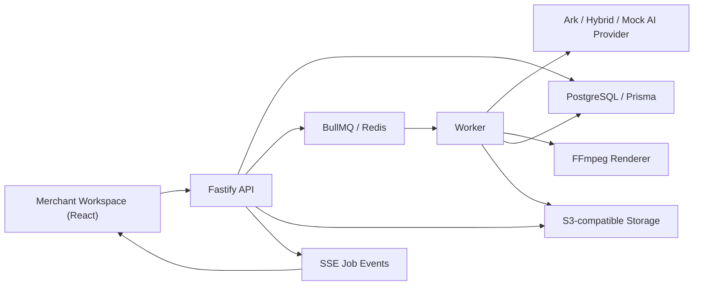

# Architecture

## Module Boundaries

- `apps/web`: seller-facing workflow, drag-and-drop storyboard editor, preview/export surface and analytics dashboard.
- `apps/api`: product, asset, script, video, job and analytics REST endpoints.
- `apps/worker`: long-running generation pipeline, including asset analysis, shot generation, rendering and retryable trace updates.
- `packages/shared`: Zod contracts and shared DTOs.
- `packages/ai`: provider interface plus Ark, Hybrid and Mock implementations.
- `packages/video`: FFmpeg-based renderer used by the worker.

## Long Task Flow

1. API creates a `GenerationJob`.
2. API enqueues a BullMQ task.
3. Worker marks job as `RUNNING`, appends trace events and updates progress.
4. Worker writes outputs to database and storage.
5. Frontend polls or subscribes to job status and displays trace.
6. Failed jobs become `RETRYABLE` and can be enqueued again.

## Data Flow

Material enters through the upload endpoint, is stored in S3-compatible storage, then analyzed into `Asset` and `AssetSlice` records. Scripts consume product data and retrieved material hints. Video creation maps each storyboard shot to a slice using lexical plus embedding similarity, attempts Ark async video generation, then renders a stable FFmpeg export. If Ark returns a video URL, that clip is used; otherwise uploaded merchant material is mixed by shot; if no usable media exists, the renderer falls back to a storyboard composite.

## Data Backflow

The analytics API accepts factor metric observations such as impressions, clicks, conversions and GMV. The dashboard aggregates those rows by creative factor and falls back to seeded demo data when no observations exist.

## Deployment

Local deployment uses Docker Compose. Cloud deployment can use Render Blueprint with external Postgres, Redis and object storage. Secrets are managed by deployment platform environment variables.
