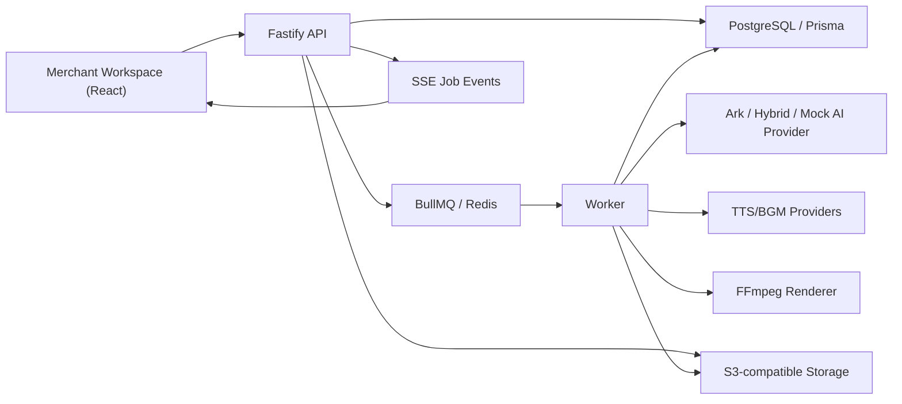

# Architecture

## Module Boundaries

- `apps/web`: seller-facing workflow, drag-and-drop storyboard editor, preview/export surface and analytics dashboard.
- `apps/api`: product, asset, script, video, experiment, compliance, job and analytics REST endpoints.
- `apps/worker`: long-running generation pipeline, including asset analysis, thumbnail extraction, shot generation, audio preparation, rendering and retryable trace updates.
- `packages/shared`: Zod contracts and shared DTOs.
- `packages/ai`: provider interface plus Ark, Hybrid and Mock implementations.
- `packages/video`: FFmpeg-based renderer used by the worker.

See [agent-architecture.md](agent-architecture.md) for the creative-agent design inspired by
Viking AI Search practices: intent parsing, retrieval planning, strategy selection, prompt
compilation, provider routing, source-labeled rendering and factor backflow.

## Long Task Flow

1. API creates a `GenerationJob`.
2. API enqueues a BullMQ task.
3. Worker marks job as `RUNNING`, appends trace events and updates progress.
4. Worker writes outputs to database and storage.
5. Frontend polls or subscribes to job status and displays trace.
6. Failed jobs become `RETRYABLE` and can be enqueued again.

## Data Flow

Material enters through the upload endpoint, is stored in S3-compatible storage, reviewed by the rules-based compliance service, then analyzed into `Asset` and `AssetSlice` records. Video assets also get per-slice thumbnail extraction through FFmpeg. Scripts consume product data and retrieved material hints. Video creation maps each storyboard shot to a slice using lexical plus embedding similarity, attempts Ark async video generation, then renders a stable FFmpeg export. If Ark returns a video URL, that clip is used; otherwise uploaded merchant material is mixed by shot; if no usable media exists, the renderer falls back to a storyboard composite. Optional TTS/BGM providers feed the renderer an audio config; mock providers synthesize deterministic local tones so CI does not need external audio services.

## A/B Experiments

The experiment API creates 2-3 `VideoVariant` rows with distinct creative factors: hook, visual style, CTA, subtitle density and voice tone. Each variant gets its own script and video generation job. The preview and analytics surfaces can compare variant status, exports and metric summaries.

## Ark Calibration

Ark video task parsing goes through a compatibility layer that extracts task id, status, error fields and artifact URLs from multiple likely response shapes. `ARK_VIDEO_DEBUG_SAMPLE=true` writes only redacted field-path samples to local storage for account-specific schema calibration.

## Data Backflow

The analytics API accepts factor metric observations such as impressions, clicks, conversions, spend, watch time and GMV. Data can arrive manually or through CSV-shaped imports. The dashboard aggregates those rows by creative factor and keeps source/channel labels visible so mock data is not confused with real campaign data.

## Deployment

Local deployment uses Docker Compose. Cloud deployment can use Render Blueprint with external Postgres, Redis and object storage. Secrets are managed by deployment platform environment variables.
