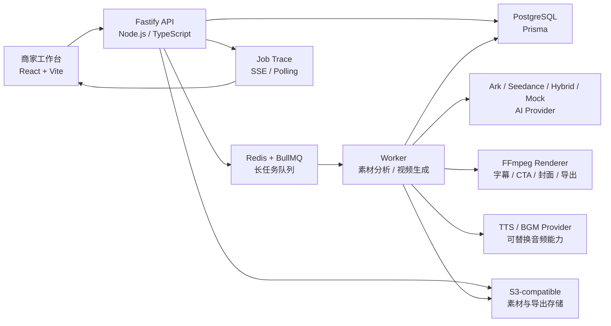

# TikTok Shop VideoPilot 完赛提报材料

## 基础信息

- 项目名称：TikTok Shop VideoPilot
- 参赛课题：电商场景 AIGC 带货视频生成系统
- 参赛形式：团队参赛
- 团队名称：我的刀盾队
- 学校：南京大学
- 团队 / 成员：曹喆、王佳铭
- 一句话核心业务价值：面向 TikTok Shop 商家，把商品信息和自有 / 授权素材快速转化为可编辑、可追踪、可导出的 15 秒以内带货短视频，并通过 A/B 变体和创作因子看板持续优化转化效果。

## 团队分工

- 曹喆：负责产品设计与前端体验，重点包括素材库、剧本工作台、创作工作台、分镜编辑、任务中心、预览导出、数据看板和演示路径设计。
- 王佳铭：负责后端、AI 与工程链路，重点包括 Fastify API、Prisma 数据模型、Redis + BullMQ 长任务、生成 trace、Ark / Seedance Provider、Prompt compiler、FFmpeg 视频渲染、合规审核和交付文档。
- 共同完成：围绕课题要求梳理 P0/P1/P2 能力范围，联调端到端流程，打磨 Seedance 真实生成样例、README、架构说明和最终提报材料。

## 核心功能清单

1. 商品与素材入库：支持商品 brief、商品图、商品视频、参考素材上传，记录素材来源声明与合规状态。
2. 多粒度素材结构化：对素材生成商品级标签、视频摘要、slice 级标签、缩略图和 embedding-style 召回信息。
3. 剧本生成与分镜干预：基于商品信息、Prompt、策略模板和约束规则生成多套带货剧本，支持分镜增删、拖拽排序、字幕、时长、镜头描述和素材 query 调整。
4. 一键成片与智能剪辑：按分镜召回素材，优先使用火山方舟 / Seedance 生成视频片段，并通过 FFmpeg 完成字幕、CTA、封面、画幅和导出。
5. 长任务进度与 trace：通过任务中心展示排队、素材召回、模型调用、音频处理、渲染导出、失败重试等全过程记录。
6. 数据回流与 A/B 对比：支持 Hook、视觉风格、CTA、字幕密度等创作因子变体，结合 mock / 手动 / CSV 数据展示 CTR、CVR、GMV、ROI 等指标。

## 端到端使用流程

用户进入系统后创建商品 brief，填写标题、类目、卖点、目标人群和使用场景。随后上传商品主图、商品视频或参考素材，并声明素材来源，系统会进入素材分析与合规审核流程。素材结构化完成后，用户可以在素材库中按关键词、标签和 slice 信息检索资产。用户在剧本工作台选择创作模板或输入 Prompt，生成多套短视频剧本，并可继续修改分镜、字幕、镜头运动、素材 query 和时长。确认剧本后进入创作工作台，选择画幅、TTS/BGM 配置，一键提交视频生成任务，或创建 A/B 出片变体。任务中心展示生成进度和 trace，包含模型调用、素材召回、渲染导出、失败兜底等节点。任务完成后，用户可以在线预览并导出 MP4。最后，用户可在数据看板导入 mock / 手动 / CSV 指标，查看不同创作因子对转化效果的影响。

## 交付材料

- 在线 Demo / 作品链接：GitHub Pages 部署后建议填写 `https://michaelcao0.github.io/tiktok/`；若评委本地复核，可使用仓库启动路径快速体验。
- 源代码仓库链接：https://github.com/MichaelCao0/tiktok
- README / 运行说明：见仓库 `README.md`
- 架构说明：见 `docs/architecture.md`
- API 清单：见 `docs/api.md`
- Agent / Prompt 说明：见 `docs/agent-architecture.md` 与 `docs/commerce-prompts.md`
- 工程说明：见 `docs/engineering.md`
- 演示视频：本地已生成 `artifacts/videopilot-demo-video.mp4`，4:00，1920x1080，30fps，约 25MB；上传到公开视频平台后，将最终链接填写到提交页。
- 真实生成样例：`apps/web/public/demo/seedance-beauty.mp4`

## 快速体验路径

### 只看产品价值

```bash
pnpm install
pnpm --filter @videopilot/web dev
```

打开 `http://localhost:5173`。如果 API / DB / Redis 不可达，前端会自动切换到 `Local reviewer data`，可直接查看商品、素材、剧本、分镜、任务 trace、数据看板和内置 Seedance 成片。

### 完整本地链路

```bash
cp .env.example .env
docker compose up -d postgres redis minio
pnpm prisma:generate
pnpm prisma:push
pnpm seed
pnpm --filter @videopilot/api dev
pnpm --filter @videopilot/worker dev
pnpm --filter @videopilot/web dev
```

火山方舟 / Seedance 相关密钥通过 `.env` 或部署平台 Secret 注入，仓库中只保留 `.env.example`，不提交真实 API Key、Endpoint、额度或账号资源信息。

## 系统架构图



## 核心技术栈

- 前端：React、Vite、TypeScript、Tailwind CSS、TanStack Query、Zustand、dnd-kit、ECharts。
- 后端：Node.js、TypeScript、Fastify、Prisma。
- 长任务：Redis、BullMQ、Worker。
- 数据层：PostgreSQL、S3-compatible object storage，schema 预留向量检索扩展空间。
- 视频处理：FFmpeg，支持素材混剪、字幕、CTA、封面、竖版 9:16 / 横版 16:9 导出。
- AI 能力：火山方舟兼容 Provider、Seedance 视频生成、Hybrid fallback、Mock Provider、Prompt compiler。
- 工程质量：ESLint、Prettier、StyleLint、Vitest、Husky、lint-staged、GitHub Actions。

## 大模型 / AI 能力说明

`packages/ai` 对外暴露统一 Provider 接口，包含 Ark、Hybrid 和 Mock 三种模式。Hybrid 模式会在配置火山方舟密钥和模型 Endpoint 后优先调用真实模型，失败时回退到确定性 Mock 结果，保证演示链路稳定。剧本生成由商品信息、策略模板、创作因子和约束规则共同驱动，输出经过 Zod schema 校验。Seedance 分镜 Prompt 会合并商品真实信息、视觉身份锁定、素材召回 hint、must show / must avoid 约束、字幕安全区要求和合规规则。视频生成结果统一进入 trace，记录 provider、状态、fallback 原因和导出来源，避免把 fallback 当作真实模型输出。

## 关键工程难点与解决方案

1. 长耗时生成任务体验：用 BullMQ + Worker 承接视频生成，前端通过任务中心展示状态、进度和 trace；失败任务标记为可重试，保留失败原因。
2. 模型输出不稳定：通过 Prompt compiler、Zod schema、Ark/Hybrid/Mock Provider、超时轮询、显式 fallback 和 source label 保证链路可复核。
3. 视频合成可控：模型只负责生成画面，字幕、CTA、封面、画幅和导出由 FFmpeg 后处理控制，避免模型生成乱码字幕或不可控 UI。
4. 素材合规与版权边界：素材上传必须填写来源声明；参考视频只保存结构化分析，不复刻、不混剪原视频；合规流覆盖素材、剧本、分镜和导出。
5. 电商增长闭环：把 Hook、视觉风格、CTA、字幕密度、旁白语气等创作因子与 CTR/CVR/GMV/ROI 聚合展示，支持后续数据回流优化。

## 项目完成度

当前为可演示 MVP。P0 必做链路已覆盖：商品素材上传、剧本生成、基础分镜、一键成片、任务进度、预览导出。P1 覆盖素材标签 / slice 检索、分镜级编辑、TTS/BGM 接口、字幕、失败重试、生成 trace、mock 数据看板。P2 覆盖 A/B 变体、创作因子归因雏形、Agent-style Prompt 编排、合规审核流、CI 质量门禁和 reviewer fallback 体验。真实广告后台同步、生产级观测平台和外部版权 / 内容安全服务作为后续扩展项。

## 项目亮点 / 创新点

1. 不是单点生成器，而是覆盖“素材 - 剧本 - 创作 - 数据回流”的商家端到端工作台。
2. 将 A/B 出片和创作因子看板引入 AIGC 视频生成，使内容生成与转化优化形成闭环。
3. 通过 Seedance 真生成样例、任务 trace、显式 fallback、合规审核和 FFmpeg 后期控制，兼顾 AI 效果、工程稳定性和可复核性。

## 作品附件建议

最终表单可附上 `artifacts/videopilot-submit-pack.zip`。附件包含：

- 提报复制稿：`submission-form-copy.md`
- 正式提报文档：`submission.md`
- README / 运行说明：`README.md`
- GitHub Pages 静态首页：`docs/index.html`
- 架构与 API 文档：`docs/architecture.md`、`docs/api.md`
- 真实 Seedance 样例视频：`docs/demo/seedance-beauty.mp4`
- 样例封面：`docs/demo/seedance-beauty.jpg`
- 4 分钟演示视频：`docs/demo/videopilot-demo-video.mp4`
- 产品截图：`docs/assets/screens/`

## 安全说明

提交材料、README、代码和附件均不包含真实 API Key、模型 Endpoint、账号、额度或其他敏感资源信息。评委如需复现真实模型调用，可在本地 `.env` 或部署平台 Secret 中自行配置火山方舟 / Seedance 参数。
